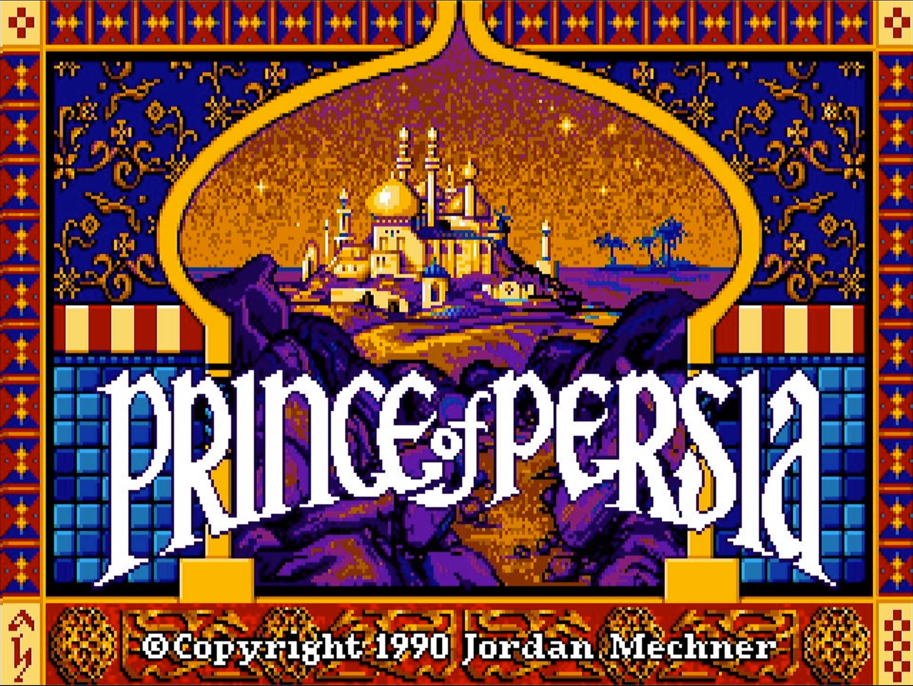
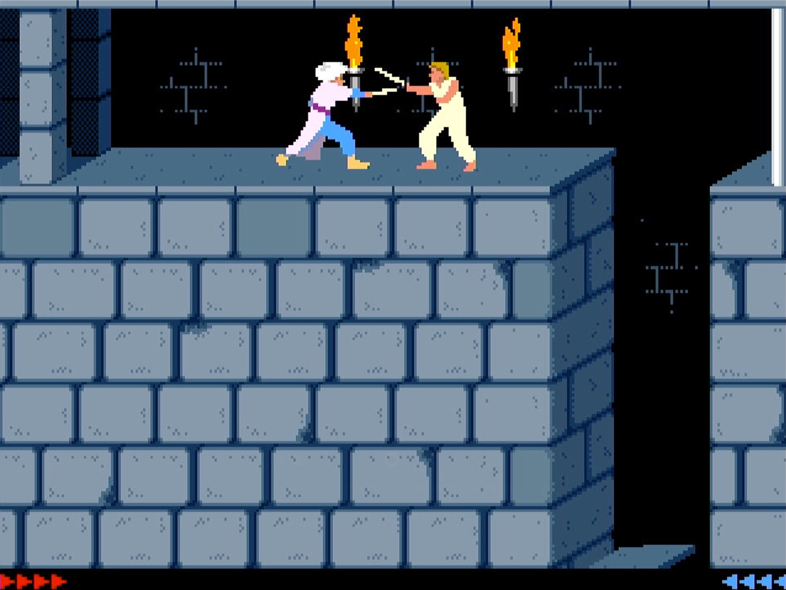
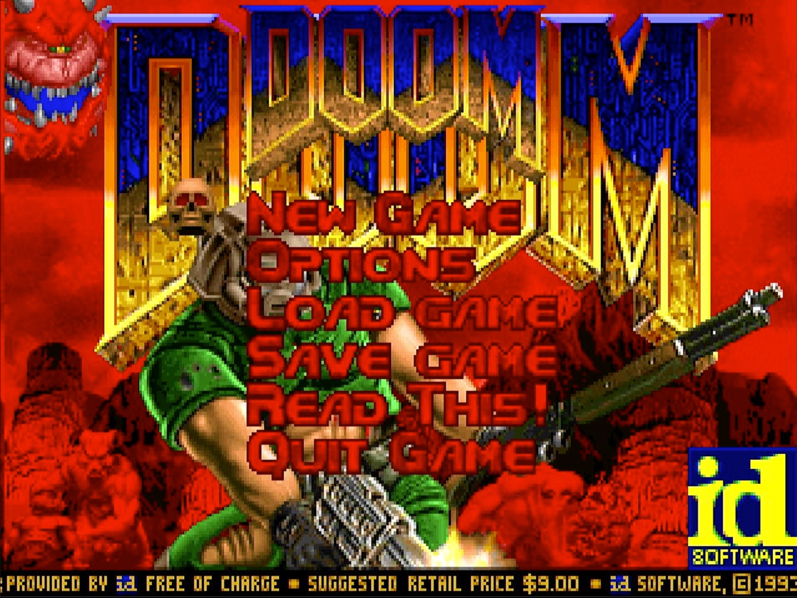
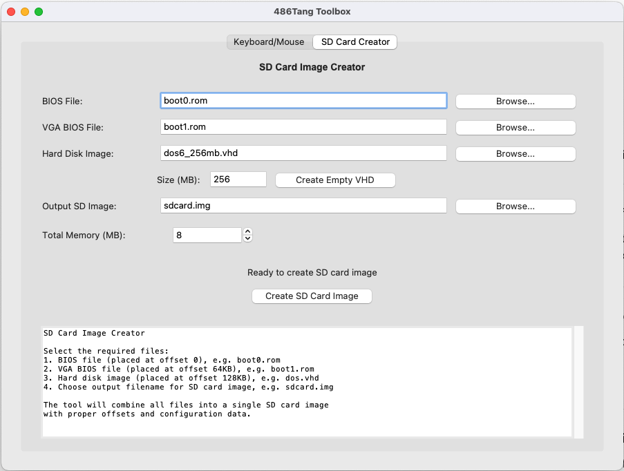
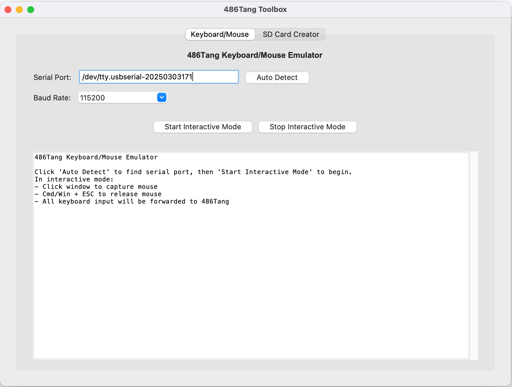
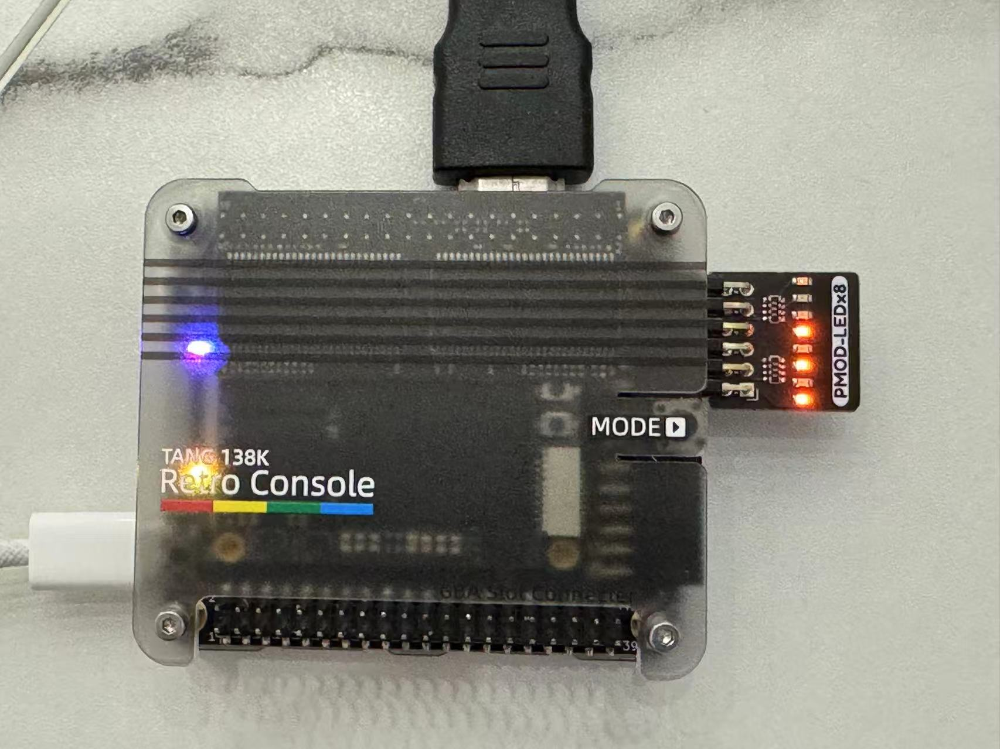

# 486Tang — 80486 on the Tang Console 138K

486Tang brings the classic 486 PC experience to Sipeed’s Tang Console 138K by porting the excellent [ao486-MiSTer](https://github.com/MiSTer-devel/ao486_MiSTer) core. It implements a 486SX-class system with VGA graphics, Sound Blaster audio, IDE storage, and solid DOS compatibility — all on your FPGA.

- Performance: roughly a 486SX-20 (no FPU).
- DOS 6.22 is very usable; dev tools like Turbo C and apps like MS Word for DOS run well.
- Best suited for games from ~1992–1993 and earlier.

## Highlights

- 486SX-compatible CPU core with full 16/32-bit instruction set
- VGA graphics, upscaled to 720p over HDMI
- Sound Blaster 16–compatible audio with OPL3 FM
- IDE/ATA controller supporting disks up to 8GB
- PS/2 keyboard and mouse emulation via host PC/Mac

## Gallery

### Gaming

<table>
<tr>
<td width="33%">
<a href="doc/prince_of_persia.jpg"></a>
<p align="center"><sub>Prince of Persia</sub></p>
</td>
<td width="33%">
<a href="doc/prince_of_persia2.jpg"></a>
<p align="center"><sub>Prince of Persia</sub></p>
</td>
<td width="33%">
<a href="doc/doom.jpg"></a>
<p align="center"><sub>DOOM</sub></p>
</td>
&nbsp;
</tr>
</table>

### Toolbox

<table>
<tr>
<td width="50%">
<a href="doc/sdcard_creator.png"></a>
<p align="center"><sub>SD Card Creator</sub></p>
 </td>
<td width="50%">
<a href="doc/key_mouse.png"></a>
<p align="center"><sub>Keyboard / Mouse over USB-Serial</sub></p>
 </td>
</tr>
</table>

## Quick Start

### What you need
- Tang Console 138K
- MicroSD card
- HDMI display (720p)
- A PC or Mac for the toolbox

### 1) Download
Grab the latest release: https://github.com/nand2mario/486tang/releases and unzip it. You’ll find:
- `486tang.fs` — FPGA bitstream
- `sw/486tang-toolbox.exe` — Windows toolbox
- `sw/486tang-toolbox.app` — macOS toolbox
- `sw/boot0.rom` — BIOS (open source)
- `sw/boot1.rom` — VGA BIOS
- `README.txt`

### 2) Flash the bitstream
Use the Gowin IDE (see Sipeed’s [guide](https://wiki.sipeed.com/hardware/en/tang/tang-console/mega-console.html)) to program `486tang.fs` into the Tang Console 138K’s flash. Use settings similar to [this](doc/flash.png).

### 3) Prepare the SD card
486Tang currently boots entirely from the MicroSD card (BIOS, CMOS, disk image). There’s no TangCore menu integration yet.

To create the MicroSD card:
- Launch the 486Tang Toolbox from the release.
- Open the “SD Card Creator” tab and provide:
  - `boot0.rom` (BIOS)
  - `boot1.rom` (VGA BIOS)
  - Your DOS `.vhd` virtual disk (for example, this [MS-DOS 6.22 disk](https://github.com/nand2mario/486tang/releases/download/v0.1/dos6_256mb.vhd.zip)).
- Write the generated sd image to your MicroSD card with a tool like [balenaEtcher](https://etcher.balena.io/).

To create a DOS virtual disk from scratch:
```bash
# Create an empty 256MB VHD (can also be done in the toolbox)
dd if=/dev/zero of=dos6_256mb.vhd bs=1m count=256

# Install MS-DOS into the VHD using QEMU
qemu-system-i386 \
  -drive file=dos6_256mb.vhd,format=raw \
  -m 64 -L . -fda msdos6_22disk1.img
```

### 4) Keyboard and mouse from your PC/Mac
Control 486Tang via USB-serial:
1. Connect the Tang Console to your computer.
2. Launch the Toolbox → “Keyboard/Mouse” tab.
3. Select the serial port and click “Start Interactive Mode”.
4. Click the pygame window to capture the mouse; your input is forwarded to the 486.

### 5) Install games
If you have a game image (e.g., from the 0MHz DOS collection):
```bash
# Mount your DOS disk (C:) and the game disk (D:) in QEMU
qemu-system-i386 \
  -drive file=dos6_256mb.vhd,format=raw,index=0 \
  -drive file=game.vhd,format=raw,index=1

# Copy from D: to C:
xcopy /s /e d:\somegame c:\somegame
```

## Troubleshooting

- macOS Gatekeeper: if the toolbox won’t launch, try:
```bash
xattr -r -d com.apple.quarantine 486tang-toolbox.app
```

- Performance expectations:
  - Target games from 1992–1993 and earlier for smooth play.
  - This is tuned for classic DOS titles, not late 486/early Pentium software.

- Boot problems:
  - Check `boot0.rom` and `boot1.rom` versions.
  - Reflash the SD card image and verify the bitstream is programmed to flash.

- How do I find the serial port?
  - macOS: it typically appears as `/dev/tty.usbserial*`. To list candidates:
  ```bash
  ls /dev/tty.*
  ```
  - Windows: it appears as `COM` plus a number (e.g., `COM3`). Open Device Manager (Windows key + X → Device Manager) and check “Ports (COM & LPT)”.

### LED diagnostics (optional PMOD)
If you have Sipeed’s LED PMOD, it helps visualize core status:



From bottom to top (LED[0] → LED[7]):
- LED[2:0]: Boot stage (0→5). 5 means BIOS/CMOS loaded and CPU started.
- LED[3]: Sound activity
- LED[4]: DDR3 init OK. This may occasionally fail; power-cycle to retry.
- LED[5]: Keyboard activity
- LED[6]: SD card activity
- LED[7]: Video activity

## Credits

- ao486-MiSTer team — original 486 implementation

## License

486Tang is based on ao486-MiSTer and follows its open-source licensing. See individual source files for details.

—

Enjoy authentic 486 PC computing on Tang FPGAs!
