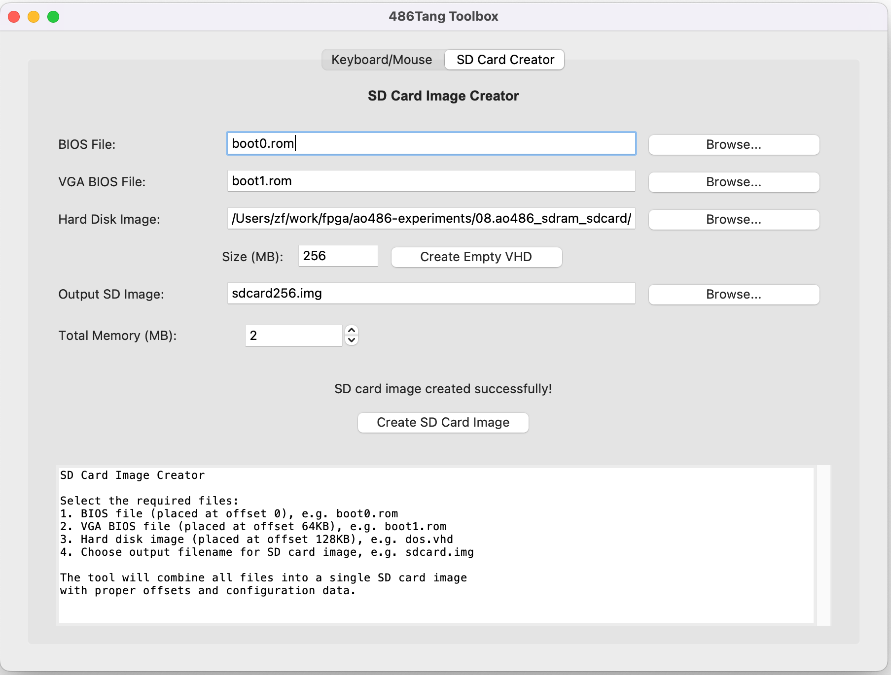

# 486Tang - 80486 for the Tang Console 138K FPGA

486Tang is a port of [ao486-MiSTer](https://github.com/MiSTer-devel/ao486_MiSTer) to the Tang Console 138K, bringing the classic 486 PC experience to Sipeed FPGA hardware. This project implements a full 486 processor with VGA graphics, Sound Blaster audio, and DOS compatibility on the Tang FPGA. It currently runs at roughly the speed of a 486SX-20 (there's no FPU). DOS 6.22 is very usable. Software like Turbo C or MS Word for DOS runs well. It can run games published up to 1992 or 1993. Enjoy!

## Features

- **Full 486SX processor core** with all instruction sets
- **VGA graphics**, upscaled to 720p HDMI
- **Sound Blaster 16 compatible audio** with OPL3 FM synthesis
- **IDE/ATA hard disk controller** supporting up to 8GB disks
- **PS/2 keyboard and mouse emulation** - use your PC/Mac as the 486's keyboard and mouse

## Screenshots

### Gaming Experience

<table>
<tr>
<td width="33%">
<a href="doc/prince_of_persia.jpg"></a>
</td>
<td width="33%">
<a href="doc/prince_of_persia2.jpg"></a>
</td>
<td width="33%">
<a href="doc/doom.jpg"></a>
</td>
</tr>
</table>

### 486Tang Toolbox

<table>
<tr>
<td width="50%">
<a href="doc/sdcard_creator.png"></a>
</td>
<td width="50%">
<a href="doc/key_mouse.png"></a>
</td>
</tr>
</table>

## Getting Started

### Prerequisites
- Tang Console 138K
- MicroSD card
- HDMI monitor

### Program Tang Console

Download a [486Tang release](https://github.com/nand2mario/486tang/releases) and unzip it. You'll find the following contents:
* 486tang.fs - FPGA bitstream
* sw/486tang-toolbox.exe - Windows 486Tang toolbox
* sw/486tang-toolbox.app - Mac 486Tang toolbox
* sw/boot0.rom - BIOS (open source)
* sw/boot1.rom - VGA BIOS
* README.txt

Use Gowin IDE (follow [Sipeed instructions](https://wiki.sipeed.com/hardware/en/tang/tang-console/mega-console.html)) to program 486tang.fs to the **flash memory** of your Tang Console 138K, using settings like [this](doc/flash.png).  

### Prepare SD Card

486Tang is not yet integrated with the [TangCore](https://github.com/nand2mario/tangcore) firmware, so there's no game loading menu or settings UI (I plan to integrate this in the future). Currently, everything it needs (hard disk data, BIOS, configurations) comes from the MicroSD card. Here's how to prepare your MicroSD card:

1. **Create a bootable DOS disk**

You could use [my empty MS-DOS 6.22 VHD file](), or create your own, for example:

```bash
# Create an all-zero .vhd
# The toolbox also includes a built-in empty VHD creator
dd if=/dev/zero of=dos6_256mb.vhd bs=1m count=256

# Use QEMU to install DOS on a VHD image
qemu-system-i386 -drive file=dos6_256mb.vhd,format=raw -m 64 -L . -fda msdos6_22disk1.img
```

2. **Prepare the SD card**
   - Launch the 486Tang Toolbox obtained from the 486Tang release
   - Use the "SD Card Creator" tab to combine:
     - `boot0.rom` (BIOS file)
     - `boot1.rom` (VGA BIOS file) 
     - Your DOS disk image (`.vhd` file)
   - Write the generated image to your SD card using any SD flash software, like [balenaEtcher](https://etcher.balena.io/)

### Keyboard/Mouse Control

For remote control via USB-serial:

1. With Tang Console connected to your Mac or PC, launch 486Tang Toolbox → "Keyboard/Mouse" tab
2. Select serial port and click "Start Interactive Mode"
3. Click the pygame window to capture mouse
4. All keyboard/mouse input will be forwarded to 486Tang

### Installing Games

**From 0MHz DOS Collection:**

```bash
# Mount both your DOS disk and game disk in QEMU
qemu-system-i386 -drive file=dos6_256mb.vhd,format=raw,index=0 -drive file=game.vhd,format=raw,index=1

# Copy game from D: to C: drive
xcopy /s /e d:\somegame c:\somegame
```

### Troubleshooting

**macOS Security:**

If the toolbox fails to launch, try this:

```bash
# Remove quarantine attribute if app won't run
xattr -r -d com.apple.quarantine 486tang-toolbox.app
```

**Slow Performance:**
- Focus on games published before 1993-1994
- 486Tang is optimized for classic DOS games, not late 486/early Pentium era software

**Boot Issues:**
- Ensure BIOS files (`boot0.rom`, `boot1.rom`) are correct versions
- Verify your SD card is properly written
- Check FPGA bitstream is correctly programmed

If you have Sipeed's LED PMOD, it can be used to diagnose the status of the core:


From bottom to top are LED[0] - LED[7]:
* LED[2:0]: boot loading stage (binary), from 0 to 5. 5 (as shown above) means BIOS and CMOS loading is complete and CPU has started.
* LED[3]: Sound activity
* LED[4]: DDR3 initialization OK (as shown above). **This sometimes fails**. Power cycling the board normally fixes this.
* LED[5]: Keyboard activity
* LED[6]: SD activity  
* LED[7]: Video activity

## Credits

- **ao486-MiSTer team** - Original 486 implementation

## License

486Tang is based on ao486-MiSTer and inherits its open-source license. See individual source files for specific licensing terms.

---

*486Tang brings authentic 486 PC gaming to Tang FPGAs!*